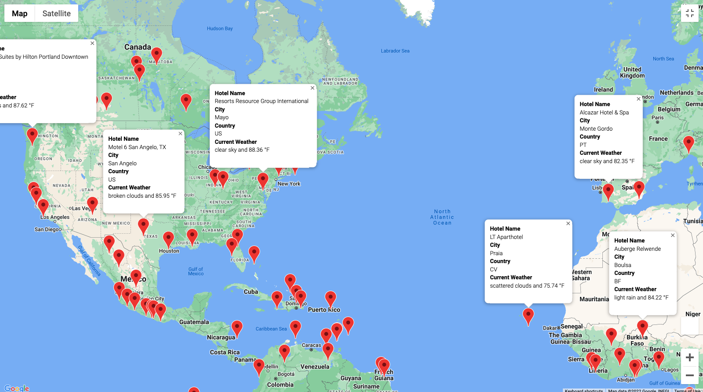
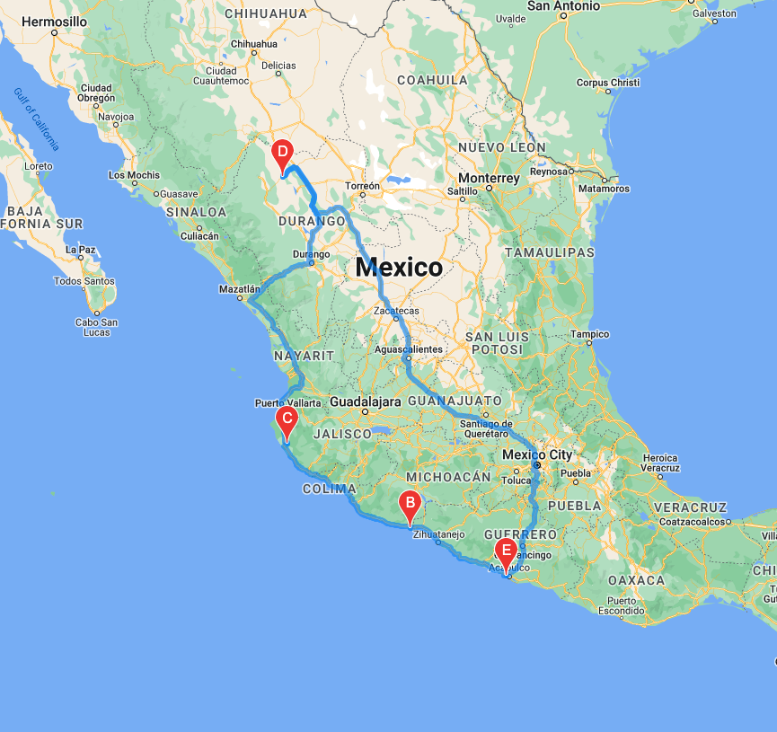

# World Weather Analysis with APIs

## Overview
This analysis compares weather patterns to provide users with random destinations around the world that fits within the user's preferred climates. 

## Data
Weather information from random cities were pulled from the Open Weather Map API on July 15, 2022. Google Directions API and Google Places API were used to retrieve information for each city and to map destinations. 

## Weather Database
After using NumPy to create random latitudes and longitudes and CityPy to identify nearest cities, the Open Weather Map API pulled weather information from **more than 700 cities**, collecting the weather information in the dataframe (shown below) and then saved in the Weather_Database folder as 'WeatherPy_Database.csv'.

## Vacation Results
I ran the cities in the 'WeatherPy_Database.csv' through the Google Directions API to retrieve hotel information for destinations with **max temperatures between 75°F - 90°F.** That information was saved in the Vacation_Search folder as 'WeatherPy_vacation.csv'. Destinations were then ploted using Google Places API as shown below.

## Itinerary Results
From the 'WeatherPy_vacation.csv', I created an sample itinerary for a Mexican vacation that stopped at the following four cities: Acapulco, La Orilla, Tomatlan, and Santa Maria Del Oro. The Google Directions API mapped the routes between each city. 

